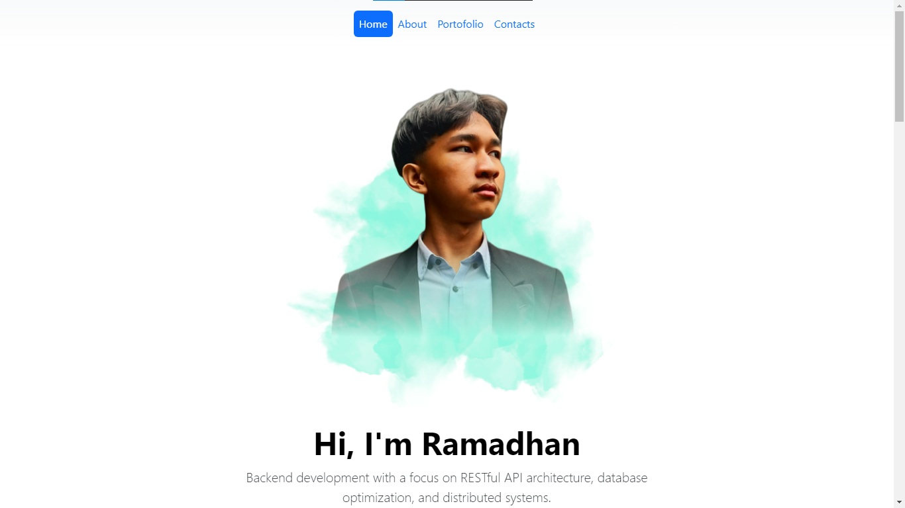

# Portfolio Website - Ramadhan



## 📌 About This Project
A modern, responsive portfolio website built with **Bootstrap 5**, showcasing my skills as a Backend Developer. Features clean design with gradient navbar, interactive sections, and smooth scrolling navigation.

## ✨ Features
- **Responsive Design**: Works on all devices
- **Interactive Elements**:
  - Smooth scroll navigation
  - Active navbar highlighting
  - Hover effects on cards and buttons
- **Sections**:
  - Hero section with call-to-action
  - Skills showcase with tech logos
  - Services (Research, Development, Collaboration)
  - Education timeline
  - Project portfolio
  - Contact form

## 🛠️ Technologies Used
- **Frontend**:
  
  
  
  

## 🚀 Installation
1. Clone the repository:
   ```bash
   git clone https://github.com/amrudzr/portfolio.git

